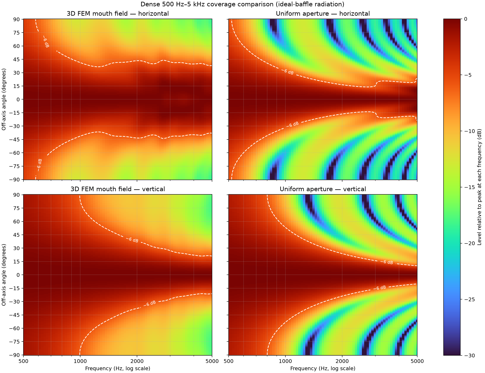
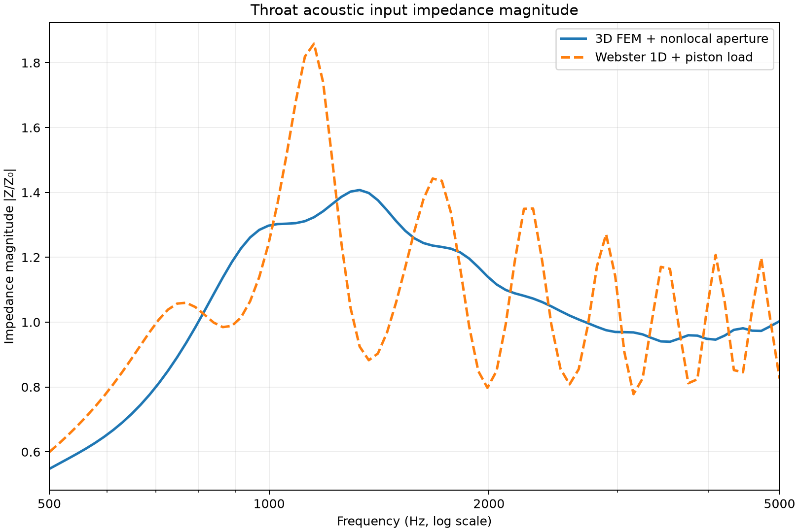
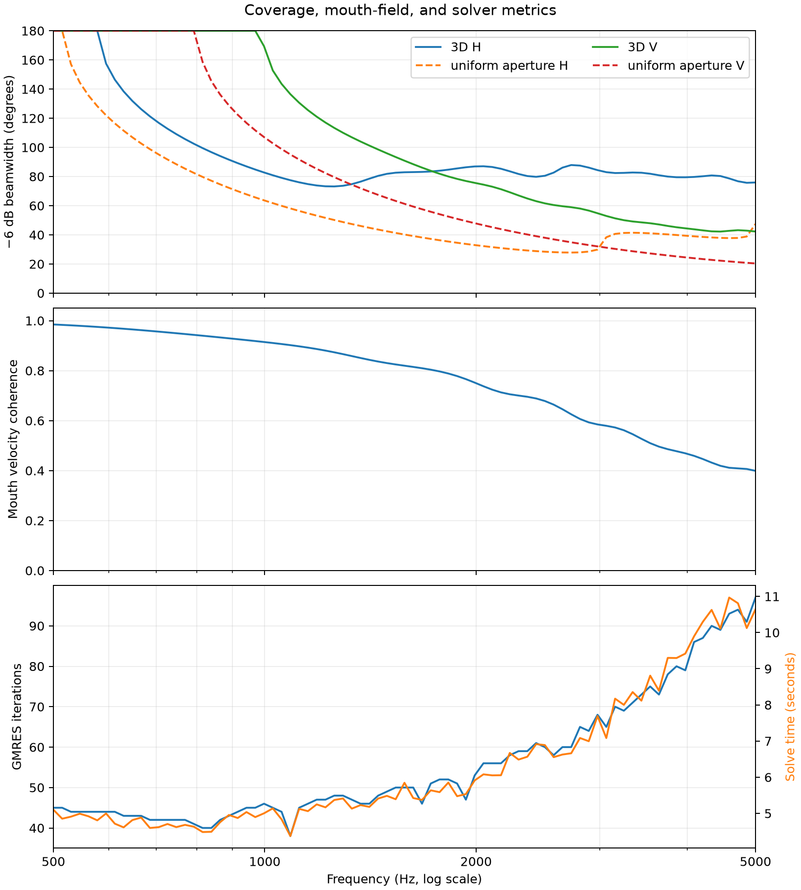

# Dense 3D / Simplified-Model Comparison

This package compares the wavelength-resolved 3D interior/aperture model with
the repository's earlier simplified models at the same 81 logarithmically
spaced frequencies from 500 Hz through 5 kHz.

The primary model is the positive-X/positive-Y symmetry quadrant of the horn's
interior air volume with rigid wall/symmetry faces, a centred unit
volume-velocity throat source, and a computational mouth surface coupled to a
four-image nonlocal infinite-baffle radiation-impedance operator. Full-mouth
fields are reconstructed by mirroring. The impedance baseline
is the lossless one-dimensional Webster model with a baffled-piston load. The
coverage baseline is the uniformly driven curved mouth aperture.

## Review first

The coverage plot uses logarithmic frequency on x, human-readable 15-degree
angle ticks on y, and a white -6 dB contour. Both predictions use ideal-baffle
radiation. The 3D result includes the solved nonuniform complex mouth velocity;
the simpler baseline assumes uniform velocity. Neither includes lip diffraction
or exterior-body scattering.

Only impedance magnitude is plotted. It is normalized by each model's own
throat characteristic impedance, which avoids confusing the small
mesh/authored throat-area difference with an acoustic-model difference.

The metrics figure compares -6 dB beamwidth, measures complex mouth-velocity
coherence, and records the solver cost across the sweep.

## Data

- `response_comparison.csv`: matched 3D and Webster impedance/power plus solver metrics.
- `coverage_data.npz`: coverage matrices, beamwidths, and mouth coherence.
- `dense_fields.npz`: compressed complex pressure/velocity fields and solver results.
- `manifest.json`: model definitions and limitations.
- `generate_comparison.py`: regeneration script; its argument is the directory
  containing resumable `d000` through `d080` MFEM field exports.

These dense results use the accepted 8-elements-per-wavelength quadrant mesh.
Representative 6/8/10-EPW comparisons at 500, 1k, 2k, 3k, 4k, and 5 kHz show
less than 0.8% change from 8 to 10 EPW in impedance magnitude, radiated power,
mouth RMS fields, and -6 dB beamwidth. See
[`../mesh_convergence/`](../mesh_convergence/) for the validation evidence.
