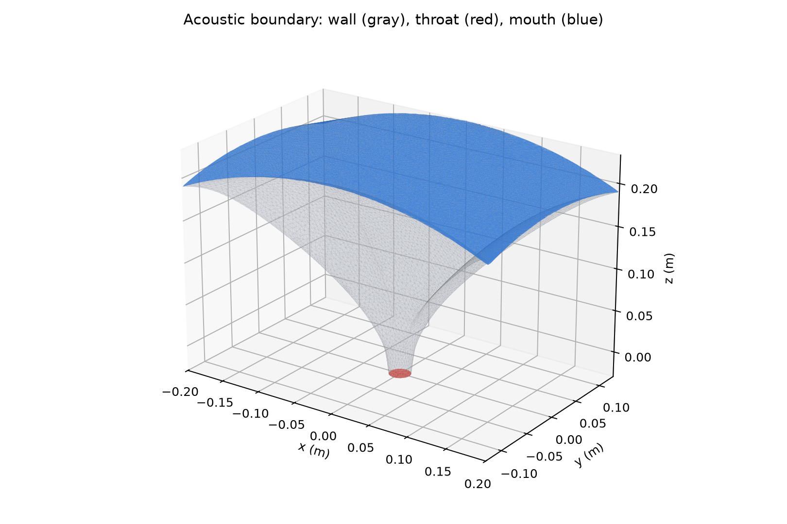
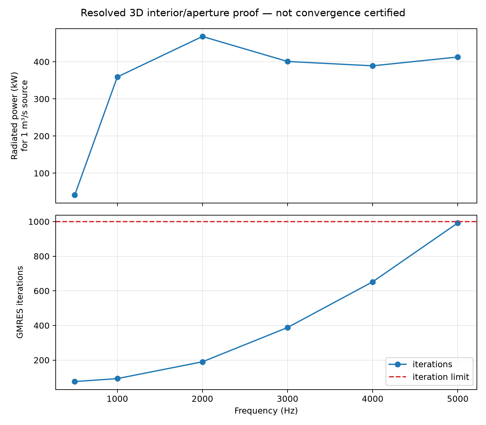

# 3D Interior/Aperture Proof of Concept

This directory is the review package for the first wavelength-resolved 3D
acoustic proof. It is deliberately self-contained: the accepted mesh, numerical
results, figures, run metadata, and reproduction entry points live together in
the repository.



## What was modeled

The computational domain is the air inside the horn, not the printable body.
The internal wall is rigid. The throat is a uniform prescribed volume-velocity
source. The mouth is closed computationally by an aperture surface coupled to a
nonlocal infinite-baffle Rayleigh radiation-impedance operator. This is the
reduced formulation selected to correspond more closely to the requested AKABAK
style model.

The source is 1 m³/s at every frequency. That is a calibration normalization,
not a realistic driver operating point, so the absolute power values are
intentionally large.

## Reviewable outputs

- [`artifacts/interior_5khz_6ppw.msh`](artifacts/interior_5khz_6ppw.msh): accepted labeled volume mesh.
- [`sweep.csv`](sweep.csv): numerical sweep and solver convergence data.
- [`manifest.json`](manifest.json): model, mesh, solver, checksum, and limitations.
- [`figures/resolved_sweep.png`](figures/resolved_sweep.png): response and iteration plot.
- [`figures/acoustic_mesh.png`](figures/acoustic_mesh.png): labeled acoustic boundary.



## Current result

The mesh contains 53,848 nodes and 282,443 tetrahedra. Its measured maximum edge
is 10.387 mm, passing the 11.440 mm limit corresponding to six elements per
wavelength at 5 kHz. Maximum boundary deviation from the authored acoustic
surface is 0.249 mm.

All six tested frequencies converged. Solver cost rises sharply with frequency:
5 kHz required 992 of the allowed 1,000 GMRES iterations. This makes the present
preconditioner adequate for the proof, but not yet comfortable for production.

## What this does not establish

This is not yet a convergence-certified response. Only the six-elements-per-
wavelength mesh has been solved. Results should not be used for design decisions
until an 8/10/12-elements-per-wavelength study stabilizes the relevant response
metrics and the high-frequency preconditioner is improved. No AKABAK comparison
has yet been performed.

## Reproduction

Install the native meshing dependencies and build MFEM as described in
[`app/README.md`](../../app/README.md). Regenerate figures with:

```bash
.venv/bin/python analysis/3d_poc/generate_review.py
```

Run a frequency from the repository root with:

```bash
/private/tmp/horncad-mfem-build/horncad_mfem_interior \
  analysis/3d_poc/artifacts/interior_5khz_6ppw.msh 5000
```

The temporary build path in that last command is not part of the deliverable;
the solver source and build configuration are committed under `app/mfem/`.
