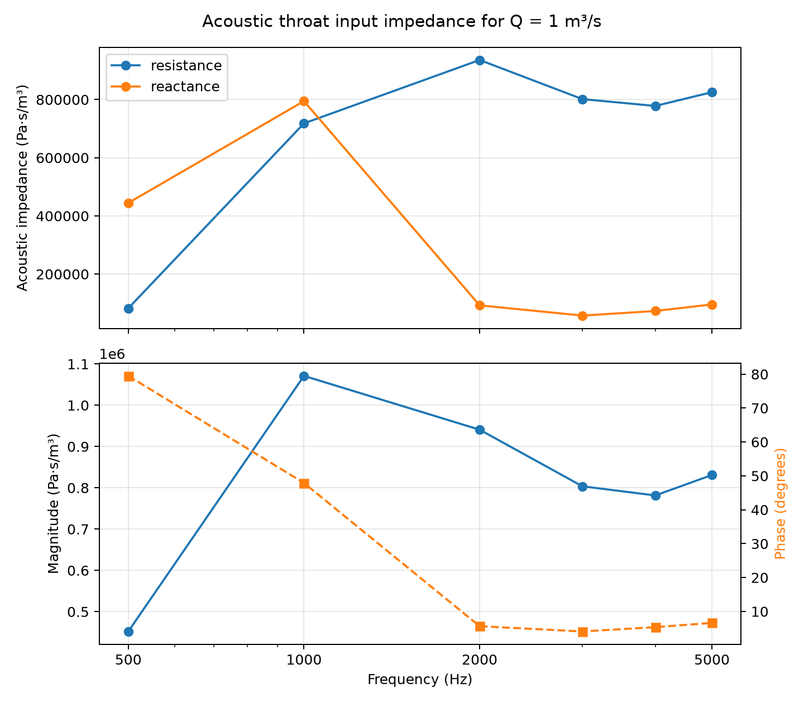
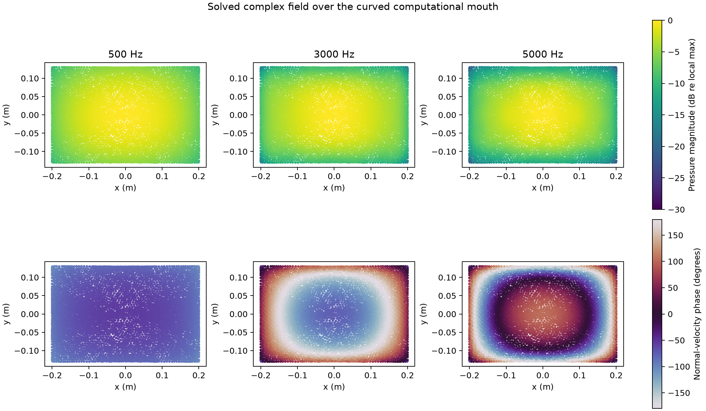
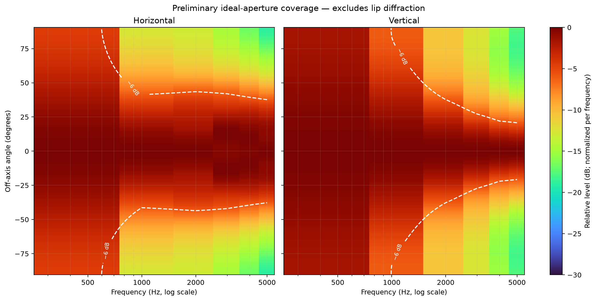

# 3D Interior/Aperture Proof of Concept

This directory is the review package for the first wavelength-resolved 3D
acoustic proof. It is deliberately self-contained: the accepted mesh, numerical
results, figures, run metadata, and reproduction entry points live together in
the repository.


## What was modeled

The computational domain is the air inside the horn, not the printable body.
The internal wall is rigid. The throat is a uniform prescribed volume-velocity
source. The mouth is closed computationally by an aperture surface coupled to a
nonlocal infinite-baffle Rayleigh radiation-impedance operator. This is the
reduced formulation selected to correspond more closely to the requested AKABAK
style model.

The source is 1 m³/s at every frequency. That is a calibration normalization,
not a realistic driver operating point, so the absolute power values are
intentionally large.

## Reviewable outputs

- [`artifacts/interior_5khz_6ppw.msh`](artifacts/interior_5khz_6ppw.msh): accepted labeled volume mesh.
- [`sweep.csv`](sweep.csv): numerical sweep and solver convergence data.
- [`impedance.csv`](impedance.csv): complex acoustic throat impedance.
- [`fields/`](fields/): weighted complex throat and mouth fields at every solved frequency.
- [`manifest.json`](manifest.json): model, mesh, solver, checksum, and limitations.
- [`figures/resolved_sweep.png`](figures/resolved_sweep.png): response and iteration plot.
- [`figures/acoustic_mesh.png`](figures/acoustic_mesh.png): labeled acoustic boundary.


## Field, impedance, and preliminary coverage outputs



The impedance is the acoustic input impedance `mean(throat pressure) / volume
velocity`, in Pa·s/m³. It is not electrical driver impedance. Only six
frequencies have been solved, so this plot is a sparse comparison artifact and
does not resolve narrow resonances.



The mouth files contain the solved complex pressure and normal velocity at all
4,006 weighted mouth nodes. These are reusable inputs for exterior radiation
calculations; the FEM solve does not need to be repeated to test different
observer grids.



The heatmaps apply a Rayleigh-style monopole-sheet propagation integral to the
solved mouth velocity and normalize each frequency independently. They include
interference across the nonuniform mouth field, but exclude finite-lip
diffraction and exterior-body scattering. Because the computational mouth is
curved while this remains an ideal-baffle approximation, these plots are
preliminary comparison results—not the eventual full-exterior prediction.
Frequency is plotted logarithmically on the x-axis, angle is on the y-axis, and
the white contour marks the −6 dB coverage boundary.

## Current result

The mesh contains 53,848 nodes and 282,443 tetrahedra. Its measured maximum edge
is 10.387 mm, passing the 11.440 mm limit corresponding to six elements per
wavelength at 5 kHz. Maximum boundary deviation from the authored acoustic
surface is 0.249 mm.

All six tested frequencies converged. Solver cost rises sharply with frequency:
5 kHz required 992 of the allowed 1,000 GMRES iterations. This makes the present
preconditioner adequate for the proof, but not yet comfortable for production.

## What this does not establish

This is not yet a convergence-certified response. Only the six-elements-per-
wavelength mesh has been solved. Results should not be used for design decisions
until an 8/10/12-elements-per-wavelength study stabilizes the relevant response
metrics and the high-frequency preconditioner is improved. No AKABAK comparison
has yet been performed.

## Reproduction

Install the native meshing dependencies and build MFEM as described in
[`app/README.md`](../../app/README.md). Regenerate figures with:

```bash
.venv/bin/python analysis/3d_poc/generate_review.py
```

Run a frequency from the repository root with:

```bash
/private/tmp/horncad-mfem-build/horncad_mfem_interior \
  analysis/3d_poc/artifacts/interior_5khz_6ppw.msh 5000
```

Persist the complex boundary fields by adding:

```bash
--output-prefix analysis/3d_poc/fields/f5000
```

The temporary build path in that last command is not part of the deliverable;
the solver source and build configuration are committed under `app/mfem/`.
