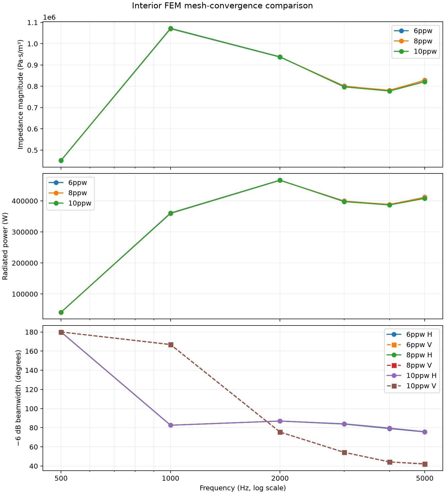
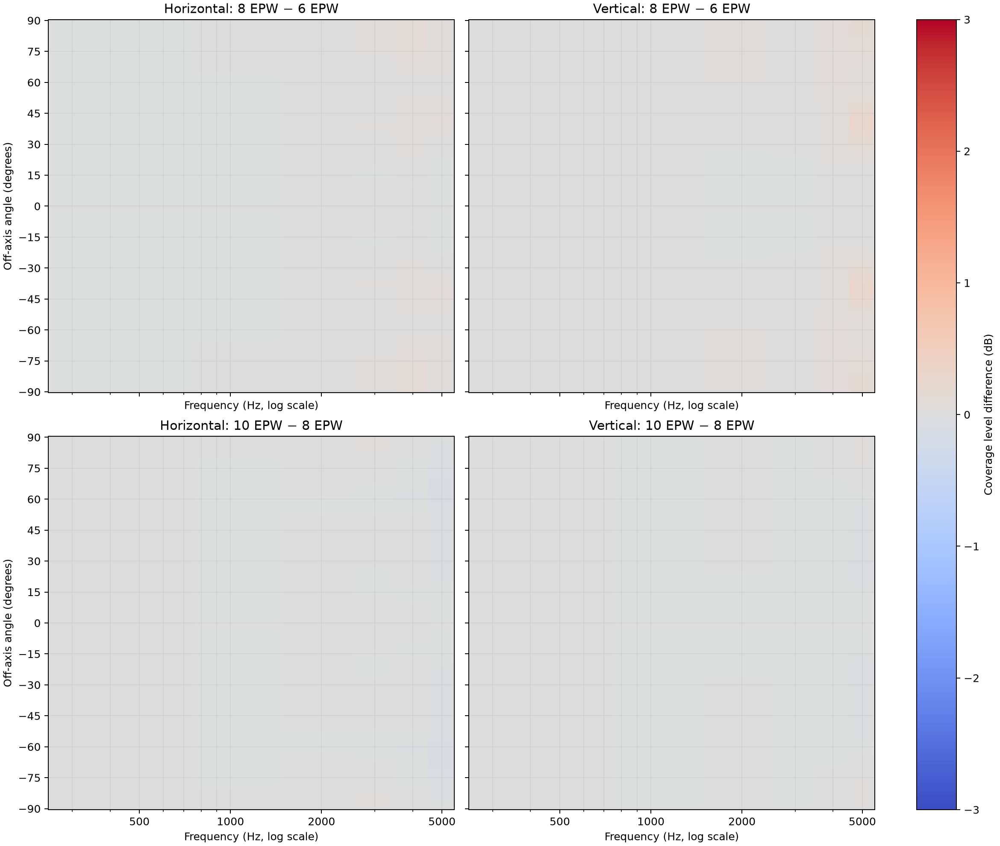

# Interior FEM Mesh-Convergence Study

This study compares otherwise identical symmetry-quadrant interior/aperture
simulations at 6, 8, and 10 elements per wavelength. The quadrant has rigid
even-pressure symmetry planes and the mouth operator sums all four mirrored
source images. Exported fields reconstruct the complete mouth.

| EPW | Nodes | Tetrahedra | Maximum edge | Limit | Meshing time |
|---:|---:|---:|---:|---:|---:|
| 6 | 14,250 | 70,749 | 10.079 mm | 11.440 mm | 27 s |
| 8 | 29,504 | 151,299 | 8.475 mm | 8.580 mm | 53 s |
| 10 | 61,018 | 326,518 | 6.618 mm | 6.864 mm | 123 s |

The quadrant implementation was checked against full-domain results at 6 and 8
EPW. Impedance magnitude agreed within 0.35%, power within 0.35%, and full-mouth
coverage RMS error remained small. At 8 EPW the measured solver speedup ranged
from 8.6x to 30.7x. Detailed values are in `symmetry_validation.csv`.

The 8-to-10 EPW comparison over 500, 1k, 2k, 3k, 4k, and 5 kHz changed:

- impedance magnitude and radiated power by no more than 0.80%;
- mouth pressure/velocity RMS by no more than 0.38%;
- horizontal/vertical -6 dB beamwidth by no more than 0.62%.

These representative-frequency metrics meet a 1% convergence criterion. The
10-EPW result is the verification reference; 8 EPW is adequate for the dense
production sweep under the present ideal-baffle aperture model.

The scripts in this directory run resumable matching frequencies and generate
impedance-magnitude, power, mouth-field, beamwidth, null, sidelobe, and coverage
difference metrics. All frequency plots are logarithmic; impedance plots show
magnitude only.

